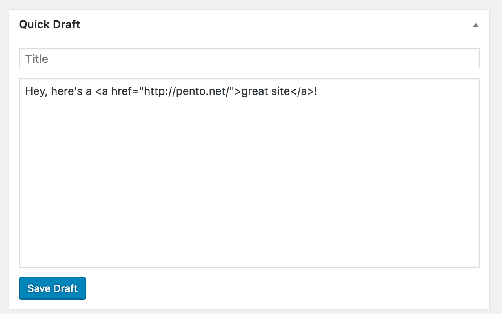
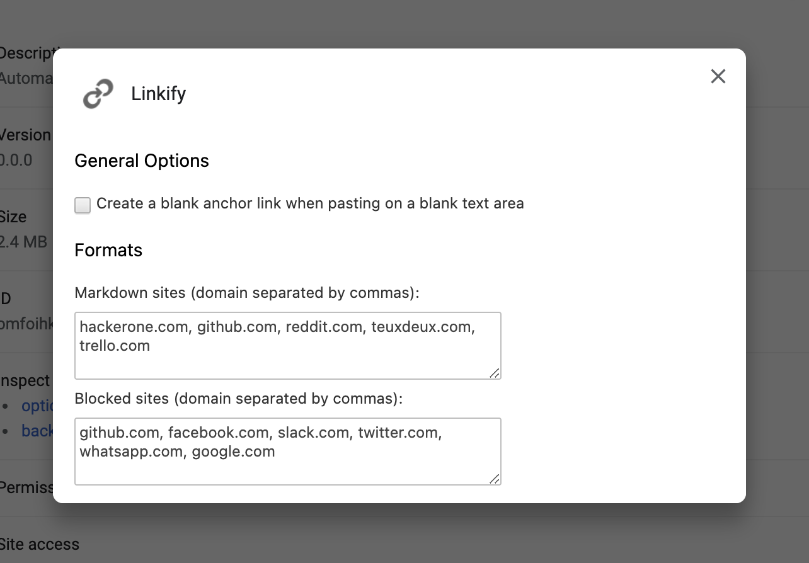

Linkify
=======

[link-webext-polyfill]: https://github.com/mozilla/webextension-polyfill
[link-rgh]: https://github.com/sindresorhus/refined-github
[link-ngh]: https://github.com/sindresorhus/notifier-for-github
[link-hfog]: https://github.com/sindresorhus/hide-files-on-github
[link-tsconfig]: https://github.com/sindresorhus/tsconfig
[link-options-sync]: https://github.com/fregante/webext-options-sync
[link-cws-keys]: https://github.com/DrewML/chrome-webstore-upload/blob/master/How%20to%20generate%20Google%20API%20keys.md
[link-amo-keys]: https://addons.mozilla.org/en-US/developers/addon/api/key

WordPress has an excellent feature, where pasting a URL onto selected text will automatically transform that text into a link.

Now you can do it everywhere!

## Screenshots

### Pasting a link in WordPress' Quick Draft

### Options page

## Installation

[Chrome Web Store](https://chrome.google.com/webstore/detail/linkify/bkkgikibkmalecfagnebbhbacnbhckmh) | [Firefox Extensions](https://addons.mozilla.org/en-US/firefox/addon/linkify-magic-links/)

## Development

### Build locally

1. Checkout the copied repository to your local machine eg. with `git clone https://github.com/my-username/my-awesome-extension/`
1. run `npm install` to install all required dependencies
1. run `npm run build`

The build step will create the `distribution` folder, this folder will contain the generated extension.

### Run the extension

Using [web-ext](https://extensionworkshop.com/documentation/develop/getting-started-with-web-ext/) is recommened for automatic reloading and running in a dedicated browser instance. Alternatively you can load the extension manually (see below).

1. run `npm run watch` to watch for file changes and build continuously
1. run `npm install --global web-ext` (only only for the first time)
1. in another terminal, run `web-ext run` for Firefox or `web-ext run -t chromium`
1. Check that the extension is loaded by opening the extension options ([in Firefox](media/extension_options_firefox.png) or [in Chrome](media/extension_options_chrome.png)).

#### Manually

You can also [load the extension manually in Chrome](https://www.smashingmagazine.com/2017/04/browser-extension-edge-chrome-firefox-opera-brave-vivaldi/#google-chrome-opera-vivaldi) or [Firefox](https://www.smashingmagazine.com/2017/04/browser-extension-edge-chrome-firefox-opera-brave-vivaldi/#mozilla-firefox).
