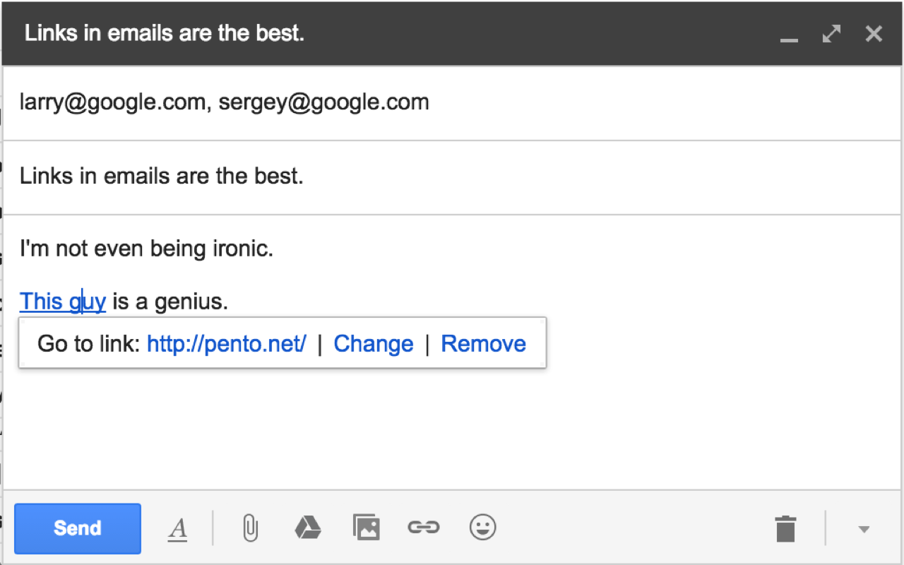

Linkify
=======

WordPress has an excellent feature, where pasting a URL onto selected text will automatically transform that text into a link.

Now you can do it everywhere!

## Installation

[Chrome Web Store](https://chrome.google.com/webstore/detail/linkify/bkkgikibkmalecfagnebbhbacnbhckmh) | [Direct download of crx file](https://github.com/pento/linkify/blob/master/dist/Linkify.crx?raw=true)

## Screenshots

 

## Development

### Installation
    git@github.com:pento/linkify.git

    # If you don't have webpack installed:
    npm install -g webpack

### Build instructions

To install dependencies:

    cd linkify
    npm install

Then to start a developing session (with watch), run:

    npm start

This will create an unpacked version of Linkify in the `build/dev` directory, which you can load in Chrome using the `Load unpacked extension...` button in your [Chrome Extensions](chrome://extensions/) page.

To start a unit testing session (with watch):

    npm test

To build production code + crx (requires `mykey.pem`):

    npm run build
